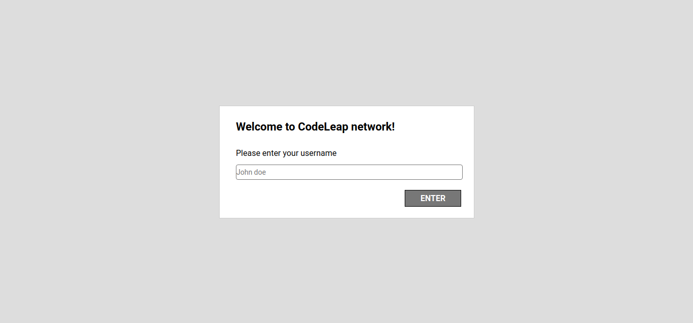
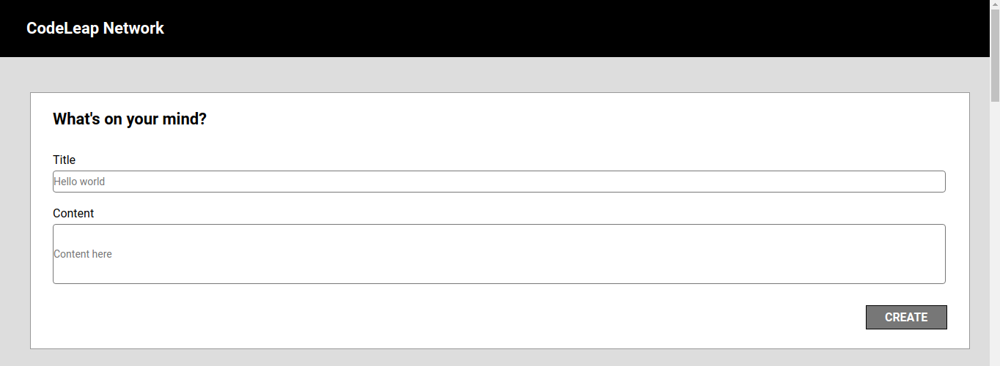
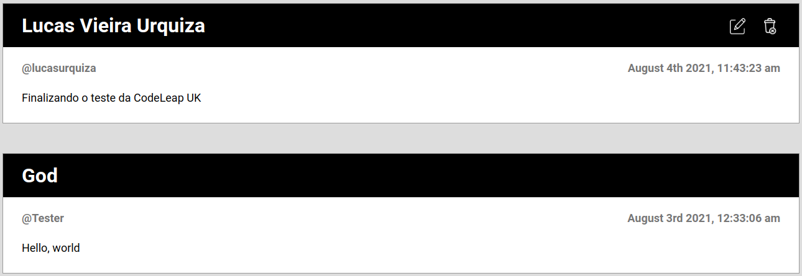
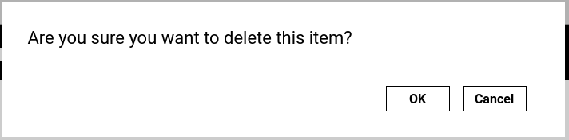
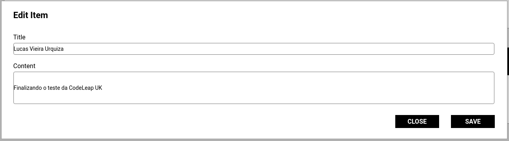

# CodeLeap - Post API CRUD :memo:

## Este projeto foi desenvolvido utilizando:

* ### [ReactJS](https://pt-br.reactjs.org/)

* ### [TypeScript](https://www.typescriptlang.org/)

* ### [Axios](https://axios-http.com/)

* ### [ContextAPI](https://pt-br.reactjs.org/docs/context.html)

* ### [Hooks](https://pt-br.reactjs.org/docs/hooks-overview.html)  

* ### [Moment.js](https://momentjs.com/)  

* ### [React Router](https://reactrouter.com/web/guides/quick-start)  

## Tutorial de Execução

### Para instalação de dependências execute:

#### `yarn`

### Para executar o projeto use:

#### `yarn dev`

### Para interromper a execução:

#### `CTRL+C` Para Linux e Windows
#### `Command+C` Para MacOS  

### Onde me encontrar:

* ##### [LinkedIn](https://www.linkedin.com/in/lucas-vieira-urquiza)

* ##### [GitHub](https://github.com/lucasvurquiza)

* ##### [Instagram](https://www.instagram.com/lucas_urquiza)

* ##### [Gmail](mailto:urquizaxd@gmail.com)

* ##### [Outlook](mailto:lucasuvie@hotmail.com)

* ##### [WhatsApp](https://api.whatsapp.com/send?phone=5562996559459)

### Prints da Aplicação

#### Tela de Signup

#### Tela de Create Post

#### Tela de List Post

#### Tela de Delete Post

#### Tela de Edit Post

